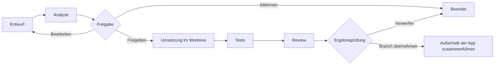
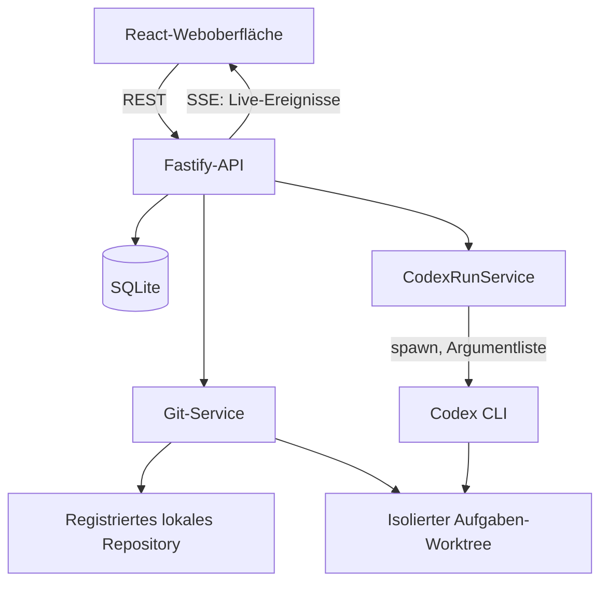

# Codex Architect

> Lokale Weboberfläche zur strukturierten, sicheren und umfangsbegrenzten Steuerung von Codex CLI.

## 1. Produktstatus

Codex Architect befindet sich in der Spezifikationsphase. Dieses Dokument definiert
Version 0.1 als verbindliches MVP. Die beschriebenen Produktfunktionen sind noch
nicht implementiert.

| Bereich | Status |
| --- | --- |
| Produktvision und MVP-Grenzen | Dokumentiert |
| Technische Umsetzung | Nicht begonnen |
| Automatisierte Tests | Nicht vorhanden |
| Nutzbarer lokaler Start | Noch nicht vorhanden |

Statusangaben in dieser README unterscheiden bewusst zwischen **geplant**,
**in Arbeit**, **teilweise umgesetzt** und **umgesetzt**. Ein Merkmal gilt erst
dann als umgesetzt, wenn es angeschlossen, lokal nutzbar und angemessen getestet
ist.

## 2. Problem

Längere KI-gestützte Entwicklungsprojekte neigen zu unkontrolliertem Wachstum:
Eine freie Anfrage führt zu zusätzlichen Funktionen, Dateien, Modulen,
Einstellungen und Abhängigkeiten, obwohl eine Erweiterung oder Vereinfachung der
bestehenden Lösung genügen würde. Dadurch steigen Wartungsaufwand,
Redundanzrisiko und der für Codex benötigte Kontext.

Codex Architect legt deshalb eine Kontroll-, Planungs- und Governance-Schicht
zwischen Benutzer, Codex CLI und ein lokales Git-Repository. Die Anwendung ist
weder eine Chat-Oberfläche ohne Prozesskontrolle noch ein Ersatz für Codex, Git,
GitHub oder eine Entwicklungsumgebung. Sie übersetzt freie Anfragen in begrenzte
Aufträge, trennt Analyse, Freigabe, Umsetzung und Review und macht tatsächliche
Änderungen vor einer Übernahme prüfbar.

## 3. Zielgruppe

Version 0.1 richtet sich an einzelne Softwareentwickler und technische
Produktverantwortliche, die:

- lokale Git-Repositories mit Codex CLI bearbeiten;
- Umfang, Architektur und Risiken eines KI-Auftrags vorab festlegen möchten;
- Änderungen vor der Übernahme anhand von Diff, Tests und Regeln prüfen müssen;
- Kontext und Tokenverbrauch durch gezielte statt vollständige Übergaben
  begrenzen möchten.

Das MVP ist ausdrücklich ein lokales Single-User-Werkzeug für vertrauenswürdige,
bereits ausgecheckte Repositories.

## 4. Produktprinzipien

1. Ein Auftrag verfolgt genau ein fachliches Hauptziel.
2. Bestehende Funktionen werden bevorzugt erweitert.
3. Neue Module benötigen eine bewusste Entscheidung.
4. Keine Funktion wird auf Verdacht eingebaut.
5. Es entsteht keine zweite Lösung für ein bereits gelöstes Problem.
6. Umfang und Risiken werden vor der Umsetzung sichtbar.
7. Codex arbeitet nur innerhalb definierter Grenzen.
8. Umsetzung und Review sind getrennte Schritte.
9. Änderungen erfolgen isoliert.
10. Tests, Diff und Rückbauweg gehören zu jeder Änderung.
11. Projektzusammenfassungen ersetzen nicht die Prüfung des aktuellen Codes.
12. Vereinfachung ist genauso wertvoll wie neue Funktionalität.

Diese Prinzipien sind Produktregeln, keine unverbindlichen Empfehlungen.
Grenzverletzungen werden in der Ergebnisansicht sichtbar ausgewiesen und dürfen
nicht von einer allgemeinen Erfolgsmeldung verdeckt werden.

## 5. Geplanter Arbeitsablauf



1. Der Benutzer registriert ein lokales Git-Projekt.
2. Er pflegt eine Projektverfassung mit Produktziel und Umfangsgrenzen.
3. Eine freie Anfrage wird als Entwurf gespeichert, aber nicht ausgeführt.
4. Der Task Compiler erzeugt daraus einen strukturierten Auftrag.
5. Ein schreibgeschützter Codex-Lauf analysiert den aktuellen Code und ergänzt
   relevante Dateien, Lösungsweg, Risiken und Testplan.
6. Der Benutzer bearbeitet, genehmigt oder verwirft den Auftrag.
7. Erst nach Freigabe erzeugt die Anwendung Aufgaben-Branch und Git-Worktree.
8. Codex implementiert ausschließlich im isolierten Worktree.
9. Die Anwendung ermittelt Git-Diff, Umfangsverletzungen und Testergebnisse.
10. Ein getrennter Review-Lauf bewertet Zielerfüllung, Sicherheit und unnötigen
    Umfang, ohne eigenmächtig weitere Funktionen einzubauen.
11. Der Benutzer verwirft den Worktree oder markiert das Ergebnis als
    abgeschlossen. Das Zusammenführen des Aufgaben-Branches erfolgt im MVP
    bewusst außerhalb der Anwendung.

## 6. MVP-Funktionsumfang für Version 0.1

### 6.1 Projektverwaltung

- Lokale Git-Projekte mit Name und lokalem Pfad registrieren.
- Pfade normalisieren und auf Existenz, Verzeichnistyp, Zugriff und gültiges
  Git-Repository prüfen.
- Doppelte Registrierungen verhindern.
- Git-Status, Standardbranch, aktuellen Commit und vorhandene Remotes lesen.
- Projekt öffnen und Repository-Zustand gezielt aktualisieren.
- Projekt aus Codex Architect entfernen, ohne das Repository zu löschen oder zu
  verändern.

### 6.2 Projektverfassung

Pro Projekt werden folgende Regeln verwaltet:

- Produktziel;
- Architekturprinzipien;
- erlaubte und unerwünschte Änderungen;
- maximale Anzahl geänderter Dateien;
- maximale Anzahl neuer Dateien;
- maximale Anzahl neuer direkter Abhängigkeiten;
- Erlaubnis oder Verbot neuer Module;
- Erlaubnis oder Verbot von Datenbankmigrationen;
- Erlaubnis oder Verbot größerer UI-Umbauten.

Beim Anlegen eines Projekts entstehen konservative Standardwerte. Änderungen an
der Verfassung gelten für nachfolgend freigegebene Umsetzungen.

### 6.3 Chat und Auftragsdefinition

- Eine freie Texteingabe als Originalanfrage speichern.
- Die Anfrage noch nicht direkt ausführen.
- Einen strukturierten Auftragsentwurf erzeugen und bearbeiten:
  - Ziel;
  - Ausgangssituation;
  - Akzeptanzkriterien;
  - betroffene Bereiche;
  - ausdrücklich ausgeschlossene Änderungen;
  - technische Grenzen;
  - Prüfschritte;
  - Risikoeinschätzung.
- Der Task Compiler arbeitet zunächst deterministisch aus Benutzeranfrage und
  Projektverfassung. Ergebnisse eines optionalen Codex-Analyselaufs werden nur
  nach Schema-Validierung übernommen.

### 6.4 Analyse vor Umsetzung

Vor jeder Implementierung läuft ein eigener, schreibgeschützter Analyseauftrag.
Er ermittelt:

- relevante Dateien und vorhandene ähnliche Funktionen;
- vorgeschlagenen Lösungsweg und erwartete Änderungen;
- erwartete neue Dateien und direkte Abhängigkeiten;
- mögliche Migrationen;
- Risiken und Testplan.

Der Analyselauf darf keinen Produktcode verändern, keine Abhängigkeiten
installieren und keine Commits erstellen.

### 6.5 Freigabeschritt

Der Benutzer kann die Analyse:

- freigeben;
- als Auftrag bearbeiten;
- ablehnen.

Ohne eine gespeicherte, gültige Freigabe darf keine Implementierung starten.
Statusübergänge werden zentral validiert.

### 6.6 Codex-CLI-Ausführung

- Lokale Verfügbarkeit und installierte Version von Codex CLI erkennen.
- Codex CLI mit `child_process.spawn`, expliziter Argumentliste und gezieltem
  Arbeitsverzeichnis starten.
- Für nicht interaktive Läufe den von der installierten Version unterstützten
  `codex exec`-Modus verwenden.
- Prompt sicher über Standardeingabe übergeben.
- Standardausgabe und Fehlerausgabe getrennt live übertragen.
- Prozessstatus, Startzeit, Laufzeit und Exit-Code speichern.
- Laufende Prozesse abbrechen.
- Persistierte Ausgabe pro Lauf begrenzen und sensible Werte maskieren.
- Fehler wie fehlende CLI, ungültiger Pfad oder Prozessabbruch verständlich
  darstellen.

Analyse, Implementierung und Review sind getrennte Codex-Läufe mit jeweils
minimal notwendigen Schreibrechten.

### 6.7 Git-Isolation

- Für jeden Implementierungsauftrag einen eindeutigen Aufgaben-Branch und echten
  Git-Worktree erzeugen.
- Basis-Commit vor Erstellung speichern.
- Reproduzierbaren, bereinigten Branch-Namen nach dem Muster
  `codex/task-<task-id>-<kurzer-slug>` verwenden.
- Worktrees ausschließlich unter einem kontrollierten Anwendungsverzeichnis
  anlegen.
- Codex ausschließlich im Aufgaben-Worktree implementieren lassen.
- Branch, Basis-Commit und Worktree-Zustand anzeigen.
- Änderungen nach ausdrücklicher Entscheidung kontrolliert verwerfen können.
- Keine automatische Zusammenführung und kein automatischer Push des
  Aufgaben-Branches.

Das MVP ist erst abgeschlossen, wenn diese Isolation tatsächlich mit lokalen
Git-Repositories funktioniert.

### 6.8 Ergebnisansicht und Umfangsprüfung

Die Ergebnisansicht zeigt:

- fachliche Zusammenfassung;
- geänderte, neue und gelöschte Dateien;
- Diff-Statistik und vollständigen oder dateiweisen Git-Diff;
- Testresultate und Review-Ergebnis;
- Warnungen und Regelverletzungen;
- Branchname und Worktree-Status;
- Aktionen zum Verwerfen oder Abschließen.

Die Umfangsprüfung wertet tatsächliche Git-Daten aus:

- Anzahl geänderter, neuer, gelöschter und ungetrackter Dateien;
- hinzugefügte und entfernte Diff-Zeilen;
- neue direkte Abhängigkeiten aus Manifesten;
- geänderte Manifest- und Lockdateien;
- neue Top-Level-Verzeichnisse;
- Datenbankmigrationen;
- Änderungen an sicherheitskritischen Dateien;
- fehlgeschlagene Tests.

Jede Regelverletzung enthält Regel, Grenzwert, Ist-Wert, betroffene Dateien,
Schweregrad und mögliche Korrektur.

### 6.9 Projektzusammenfassungen

- Kompakte, dateibasierte Markdown-Zusammenfassungen pro Projektbereich in
  anwendungseigener Speicherung verwalten.
- Aktualisierungszeitpunkt und zugrunde liegende Git-Commit-ID speichern.
- Zusammenfassungen bei abweichendem Commit oder Änderungen in ihrem Bereich
  als veraltet kennzeichnen.
- Veraltete Zusammenfassungen anzeigen, aber nicht als zweifelsfreie Wahrheit
  an Codex übergeben.
- Nur für den Auftrag relevante Zusammenfassungen und Pfade in ein
  Kontextpaket aufnehmen.

Codex Architect verändert fremde Zielprojekte nicht ungefragt durch eigene
Metadateien.

### 6.10 Auftragsverlauf

Pro Auftrag werden nachvollziehbar gespeichert:

- Status, Phase und Zeitpunkte;
- Freigabe- und Ablehnungsentscheidungen;
- zugehörige Codex-Läufe;
- Ergebnisse, Exit-Codes und Fehler;
- Worktree und Aufgaben-Branch.

Vorgesehene Statuswerte sind `draft`, `analyzing`, `awaiting_approval`,
`approved`, `implementing`, `reviewing`, `completed`, `failed`, `rejected` und
`cancelled`. Eine kleine zentrale Übergangstabelle ersetzt eine allgemeine
Workflow-Engine.

### 6.11 Funktionale Weboberfläche

Die deutschsprachige, desktop-orientierte und responsive Oberfläche besitzt
maximal die Hauptnavigation **Projekte**, **Aufgaben** und **System**.
Projektbezogene Unterbereiche sind **Übersicht**, **Chat und Aufgaben**,
**Projektregeln** und **Zusammenfassungen**.

Die zentrale Aufgabenansicht zeigt:

- links eine begrenzte Projekt- oder Modulübersicht;
- mittig Anfrage, Auftragsentwurf und größenbegrenzte Live-Ausgabe;
- rechts Umfang, Risiko, Dateien, Abhängigkeiten und Regelverletzungen.

Der Phasenpfad `Entwurf → Analyse → Freigabe → Umsetzung → Tests → Review →
Ergebnis` bleibt sichtbar. Status wird nie ausschließlich über Farbe vermittelt.
Formulare sind tastaturbedienbar, Fehler erscheinen am relevanten Feld und
irreversible Aktionen sind eindeutig benannt.

### 6.12 Systemstatus

Eine Systemansicht zeigt:

- Codex-CLI-Verfügbarkeit und Version;
- Git-Verfügbarkeit und Version;
- Node.js-Version;
- Datenbankstatus.

„Nicht installiert“ ist ein normaler, erklärter Zustand und kein vorgetäuschter
Erfolg.

## 7. Bewusst nicht Teil des MVP

Version 0.1 enthält ausdrücklich nicht:

- SaaS-Betrieb;
- Benutzerregistrierung;
- Teams und Rechteverwaltung;
- Bezahlfunktionen;
- mobile App;
- Cloud-Synchronisierung;
- GitHub-, GitLab- und Bitbucket-Komplettintegration;
- autonomes Deployment;
- Plugin-Marktplatz;
- Sprachsteuerung;
- vollständigen Codeeditor;
- parallele Multi-Agent-Schwärme;
- automatische Produktentscheidungen ohne Benutzerfreigabe;
- unbegrenzte Shell-Ausführung;
- beliebige Remote-Repositories ohne lokalen Checkout;
- Vektordatenbank oder Vollindexierung;
- automatischen Merge oder Deployment-Workflow.

## 8. Grobe Systemarchitektur

Da das Repository zu Beginn keine Anwendungstechnik enthält, ist ein modularer
Monolith als npm-Workspace geplant. Frontend und Backend laufen als getrennte
Prozesse, teilen aber Typen und Validierung dort, wo das eine konkrete
Doppelimplementierung verhindert.



Geplanter Stack:

| Schicht | Entscheidung | Begründung |
| --- | --- | --- |
| Workspace | npm Workspaces, TypeScript | Einfache lokale Installation, gemeinsame Qualitätsregeln |
| Frontend | React, Vite, React Router | Kleine, klar gegliederte Weboberfläche |
| Server | Node.js 22+, Fastify, REST, SSE | Sicherer Prozessstart und unidirektionales Live-Streaming |
| Validierung | Zod | Gemeinsame Laufzeitvalidierung für API und Task-Schema |
| Persistenz | SQLite | Einzelner lokaler Prozess, keine vorhandene Datenbankinfrastruktur |
| Tests | Vitest | Unit- und Integrationstests im TypeScript-Stack |
| Prozesssteuerung | `child_process.spawn` | Argumentlisten, getrennte Streams, Abbruchsignal |

TanStack Query, Monaco Editor, Playwright und ein globales State-Framework werden
nur ergänzt, wenn die Implementierung einen nachgewiesenen MVP-Bedarf zeigt.
Aus heutiger Sicht sind sie nicht vorgesehen.

Fachliche Module werden nur angelegt, wenn sie Code enthalten:

- `projects` und `constitutions`;
- `tasks`;
- `codex-runs`;
- `git-worktrees`;
- `summaries`;
- `system`.

## 9. Sicherheitsmodell

Codex Architect bindet den Server standardmäßig ausschließlich an
`127.0.0.1`. Das ist kein Schutz gegen bereits lokal kompromittierte Prozesse,
begrenzt aber unbeabsichtigten Netzwerkzugriff.

### Pfade und Repositories

- Registrierbare Projektpfade werden kanonisch aufgelöst und müssen unter
  explizit erlaubten Wurzelverzeichnissen liegen.
- Pfade müssen existieren, lesbare Verzeichnisse und gültige lokale
  Git-Repositories sein.
- Worktree-Pfade müssen nach kanonischer Auflösung innerhalb des kontrollierten
  Worktree-Roots liegen.
- Benutzereingaben werden weder als Shell-String noch als Pfadfragment ungeprüft
  verwendet.

### Prozesse

- Dynamische Prozessaufrufe verwenden `spawn` ohne `shell: true`.
- Programm und erlaubte Argumentvarianten werden zentral definiert.
- Analyse läuft mit Codex-Sandbox `read-only`; Implementierung und Review erhalten
  nur die für den isolierten Worktree notwendige Berechtigung.
- Codex darf nicht automatisch außerhalb des Projektkontexts arbeiten.
- Jeder laufende Kindprozess besitzt eine Abbruchmöglichkeit und ein
  kontrolliertes Beendigungsverfahren.
- Hängende oder nach Serverneustart verwaiste Läufe werden als Fehler markiert,
  nicht als erfolgreich.

### Daten und Logs

- API-Schlüssel und andere Secrets werden nie in Projekt- oder
  Anwendungsdatenbank gespeichert.
- Codex erbt nur eine begrenzte, dokumentierte Umgebung.
- Sensible Umgebungsvariablen werden weder geloggt noch an das Frontend
  übertragen; bekannte Muster werden in Ausgaben maskiert.
- Persistierte Logs haben ein festes Größenlimit. Live-Ansichten halten nur ein
  begrenztes Fenster im Browser.
- Es gibt keine Telemetrie ohne ausdrückliche spätere Konfiguration.

### Git

- Der Standardbranch wird nicht direkt durch Implementierungsläufe verändert.
- Es gibt keinen Force-Push, History-Rewrite oder automatischen Merge.
- Bestehende Branches werden nicht überschrieben.
- Ein Worktree mit ungesicherten Änderungen wird nur nach einer ausdrücklichen
  Verwerfungsentscheidung entfernt.

## 10. Kontext- und Tokenstrategie

Das MVP verwendet keine Vollindexierung und keine Vektordatenbank. Ein
Kontextpaket wird pro Lauf aus überprüfbaren, begrenzten Bestandteilen erstellt:

1. aktuelle Projektverfassung;
2. strukturierter, freigegebener Auftrag;
3. ausdrückliche Nicht-Ziele und Umfangsgrenzen;
4. aktuelle relevante Zusammenfassungen;
5. relevante Pfade und ausgewählte aktuelle Dateien;
6. notwendige Git-Informationen;
7. konkrete Testbefehle.

Komplette Chatverläufe, vollständige historische Logs und irrelevante
Projektbereiche werden nicht pauschal übertragen. Jede Zusammenfassung speichert
ihren Quell-Commit. Bei Abweichungen prüft die Anwendung ihre Aktualität; Codex
muss betroffene aktuelle Dateien weiterhin selbst lesen. Eine Zusammenfassung
ist ein Wegweiser, kein Ersatz für Quellcodeprüfung.

## 11. Git- und Worktree-Strategie

Analyse läuft lesend im registrierten Projekt. Nach Freigabe:

1. Basis-Commit des Standardbranches bestimmen;
2. sichere Aufgaben-ID und bereinigten Slug erzeugen;
3. Existenz des Zielbranches und Zielpfads ausschließen;
4. Branch `codex/task-<task-id>-<kurzer-slug>` am Basis-Commit erstellen;
5. Worktree unter dem konfigurierten Worktree-Root anlegen;
6. Implementierung, Tests, Diff und Review dort ausführen;
7. Ergebnis und Branch für die externe Übernahme anzeigen.

„Verwerfen“ entfernt einen geänderten Worktree erst nach ausdrücklicher
Bestätigung. Der Aufgaben-Branch bleibt standardmäßig als Rückbau- und
Prüfpunkt erhalten, sofern der Benutzer nicht ebenfalls dessen sichere
Entfernung veranlasst. Das ursprüngliche Repository wird nicht bereinigt,
zurückgesetzt oder automatisch zusammengeführt.

## 12. Geplante Projektstruktur

Die genaue Struktur wird nach dem Baseline-Commit in einem Implementierungsplan
festgelegt. Für das leere Ausgangs-Repository ist folgende kleine
Workspace-Struktur vorgesehen:

```text
.
├── apps/
│   ├── server/          # Fastify-API, Persistenz, Git- und Codex-Dienste
│   └── web/             # React-Oberfläche
├── packages/
│   └── shared/          # Gemeinsame Schemas und notwendige Typen
├── docs/
│   └── implementation-plan.md
├── package.json
└── README.md
```

Weitere Pakete, leere Fachmodule und allgemeine Abstraktionsschichten sind nicht
vorgesehen. Die Struktur darf in der Implementierung vereinfacht werden, wenn
dadurch weniger Doppelcode und Dateien entstehen.

## 13. Entwicklungsphasen

1. **Produktspezifikation:** README als alleinige Änderung festschreiben und
   separat versionieren.
2. **Technischer Plan:** Ist-Zustand bestätigen, Datenmodell, API,
   Sicherheitsgrenzen und Teststrategie dokumentieren.
3. **Workspace und Persistenz:** minimalen Workspace, SQLite-Schema,
   Konfiguration und Systemstatus aufbauen.
4. **Projekt-Governance:** Projektregistrierung und Projektverfassung
   implementieren.
5. **Auftragsworkflow:** deterministischen Task Compiler, Statusübergänge,
   Analyse und Freigabe umsetzen.
6. **Sichere Ausführung:** CodexRunService, SSE-Streaming und Prozessabbruch
   implementieren.
7. **Isolation und Review:** echte Worktrees, Git-Diff, Umfangsprüfung, Tests und
   Review-Ergebnisse anbinden.
8. **Kontext:** versionierte Projektzusammenfassungen und begrenzte
   Kontextpakete ergänzen.
9. **Oberfläche:** alle MVP-Abläufe ohne tote Aktionen anschließen.
10. **Qualität und Dokumentation:** kritische Abläufe testen, Build prüfen und
    README an den tatsächlichen Stand anpassen.

## 14. Definition of Done für Version 0.1

Das MVP ist erst abgeschlossen, wenn nachweisbar:

- die Produktvision separat committed wurde;
- die Implementierung auf einem eigenen Feature-Branch liegt;
- lokale Git-Projekte registriert und ungültige oder doppelte Pfade abgelehnt
  werden;
- Projektverfassungen bearbeitet werden können;
- freie Anfragen als validierte strukturierte Aufträge gespeichert werden;
- Analyse und Implementierung getrennt sind;
- ohne Freigabe keine Implementierung startet;
- die echte lokale Codex CLI erkannt, sicher gestartet und abgebrochen werden
  kann;
- stdout und stderr live und größenbegrenzt sichtbar sind;
- Implementierungen in echten isolierten Git-Worktrees laufen;
- tatsächliche Git-Diffs und Dateistatistiken angezeigt werden;
- Umfangsgrenzen und neue direkte Abhängigkeiten geprüft werden;
- Tests und kritische Review-Ergebnisse sichtbar sind;
- veraltete Projektzusammenfassungen erkannt werden;
- Frontend und Backend erfolgreich bauen;
- Unit- und Integrationsprüfungen für die kritischen Abläufe erfolgreich laufen;
- Dokumentation und tatsächlicher Stand übereinstimmen;
- keine Secrets oder unnötigen MVP-fremden Funktionen enthalten sind.

## 15. Lokale Voraussetzungen

Für die geplante Umsetzung:

- Node.js 22 oder eine kompatible aktuelle LTS-Version;
- npm 10 oder kompatibel;
- Git 2.43 oder kompatibel mit `git worktree`;
- lokal installierte und authentifizierte Codex CLI;
- ein moderner Desktop-Browser;
- lokale Schreibrechte für Anwendungsdaten- und Worktree-Verzeichnis.

Codex Architect benötigt keinen Cloud-Datenbankdienst. Zugangsdaten für Codex
bleiben in der von Codex CLI verwalteten lokalen Konfiguration und werden nicht
von der Anwendung abgefragt.

## 16. Geplante Start- und Prüfbefehle

Nach der noch ausstehenden Implementierung sollen wenige Root-Befehle genügen:

```bash
npm install
npm run dev
```

Für Qualitätsprüfungen:

```bash
npm run lint
npm run typecheck
npm test
npm run build
```

Diese Befehle sind im aktuellen Spezifikationsstand noch nicht verfügbar. Die
Implementierung muss README und Befehle gemeinsam auf einen tatsächlich
geprüften Stand bringen.

## 17. Nachweisstrategie

Mindestens folgende Prüfungen sind für das MVP vorgesehen:

- Unit-Tests für Pfadvalidierung, Branch-Slugs, Task-Schema,
  Statusübergänge, Umfangsgrenzen, neue Dateien, neue direkte Abhängigkeiten,
  Secret-Maskierung, Logbegrenzung und veraltete Zusammenfassungen;
- Integrationstests mit temporären Git-Repositories für Registrierung,
  Status, Branch- und Worktree-Erstellung, Diff und kontrollierte Entfernung;
- ein austauschbarer Test-Prozessadapter, damit automatisierte Tests keinen
  echten Codex-Lauf ausgeben oder benötigen;
- ein kritischer durchgängiger Workflow aus Projekt, Verfassung, Auftrag,
  Analyse, Freigabe, Umsetzungslauf und Ergebnis;
- manuelle Prüfung der lokal installierten Codex-Version und ihrer tatsächlichen
  `exec`-Syntax.

Playwright wird nur aufgenommen, wenn ein browserbasierter End-to-End-Test den
zusätzlichen Installations- und Wartungsumfang rechtfertigt. Andernfalls decken
Backend-Integrationstests und Frontend-Komponententests den kritischen Ablauf ab
und die Abweichung wird dokumentiert.

## 18. Spätere mögliche Erweiterungen – nicht Teil des MVP

Die folgenden Ideen dürfen nach Version 0.1 neu bewertet werden, werden aber im
MVP nicht implementiert:

- kontrollierter Merge nach zusätzlicher Schutz- und Konfliktprüfung;
- optionale GitHub-Statusverknüpfung für bereits lokale Repositories;
- explizit konfigurierbare Telemetrie für lokale Laufzeiten und Tokenbudgets;
- feinere, weiterhin dateibasierte Kontextauswahl für sehr große Monorepos;
- exportierbare Governance-Vorlagen für wiederkehrende Projekttypen.

Diese Liste ist keine Roadmap-Zusage. Jede Erweiterung benötigt ein konkretes
Problem, eine eigene Umfangsentscheidung und den Nachweis, dass bestehende
Strukturen nicht ausreichen.
